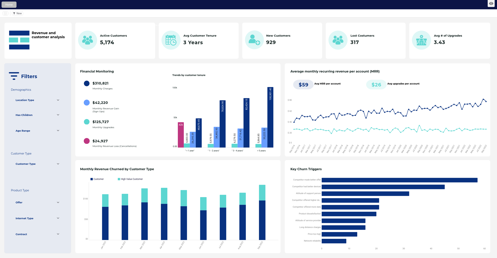

# IBM Telco churn
---
Dataset orign: IBM
Dataset download from: https://www.kaggle.com/datasets/ylchang/telco-customer-churn-1113?select=Telco_customer_churn_demographics.xlsx
Astrato database: SF.DEMO_DATASET.Telecom_Churn
Astrato demo workbook: Telecom Customer and Revenue_V3
---
## Recreation of Astrato's demo workbook

1. KPIs
    1. Active Customers
        - value: 5,174
        - item type: Number
        - property panel settings:
            - Data
                - Measure: Count distinct Customer ID
                - Format
                    - date type: Number
                    - abbreviation: 1
                    - default format: -123
            - Filter
                - Chart filters
                    - Customer Status does not equal Churned
    2. Avg Customer Tenure
        - value: 3 Years
        - item type: Number
        - property panel settings:
            - Data
                - Measure: AVG of Field12
                    - Format
                        - date type: Number
                        - abbreviation: 1
                        - default format: -123
                        - Prefix/Suffix: Suffix
                        - Prefix/Suffix value: ` Years`
            - Filter
                - Chart filters
                    - Customer Status does not equal Churned
    3. New Customers
        - value: 929
        - item type: Number
        - property panel settings:
            - Data
                - Measure: Count distinct Customer ID
                    - Format
                        - date type: None
            - Filter
                - Chart filters
                    - Signupyear equals 2022
    4. Lost Costumers
        - value: 317
        - item type: Number
        - property panel settings:
            - Data
                - Measure: Count distinct Customer ID
                    - Format
                        - date type: None
            - Filter
                - Chart filters
                    - Customer Status equals Churned
    5. Avg # of Upgrades
        - value: 3.43
        - item type: Number
        - property panel settings:
            - Data
                - Measure: AVG Add Ons 
#ToDo   Figure out how the "Add Ons value" is calculated 

                    - Format
                        - date type: Number [None, Number, Abbreviation, Percentage, Money, Custom]
                        - abbreviation: 
                        - default format:
                        - Prefix/Suffix:
                        - Prefix/Suffix value:
            - Filter
                - Chart filters
                    - Customer Status equals Churned

### DVE data preparation

 KPIs
    1. Active Customers
        - DVE item: 
            - item type: 

### Manual data template
