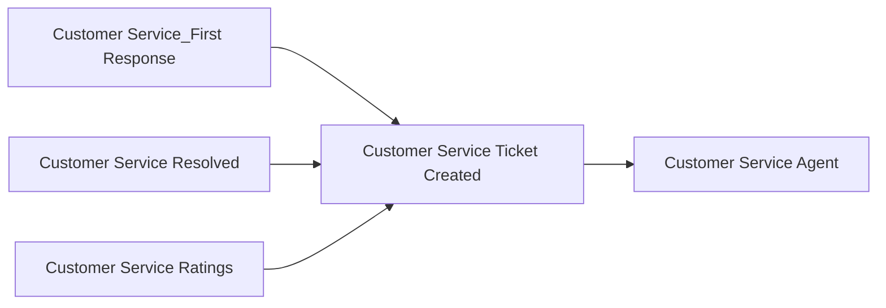
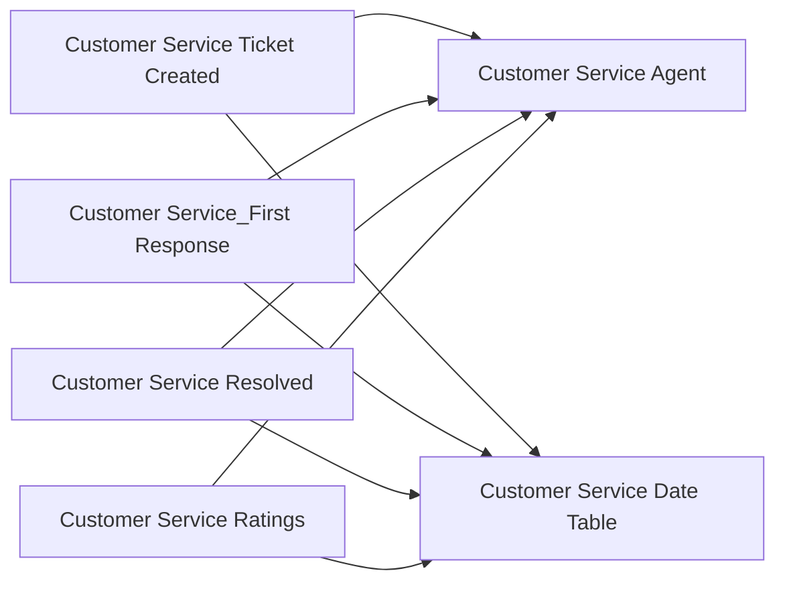

```mermaid

  graph LR;
      A[Customer Service Ticket Created]-->E[Customer Service Agent];
      B[Customer Service_First Response]-->A[Customer Service Ticket Created];
      C[Customer Service Resolved]-->A[Customer Service Ticket Created];
      D[Customer Service Ratings]-->A[Customer Service Ticket Created];
```

```mermaid

  graph LR;
      A[Customer Service Ticket Created]-->E[Customer Service Agent];
      A[Customer Service Ticket Created]-->F[Customer Service Date Table];
      B[Customer Service_First Response]-->E[Customer Service Agent];
      B[Customer Service_First Response]-->F[Customer Service Date Table];
      C[Customer Service Resolved]-->E[Customer Service Agent];
      C[Customer Service Resolved]-->F[Customer Service Date Table];
      D[Customer Service Ratings]-->E[Customer Service Agent];
      D[Customer Service Ratings]-->F[Customer Service Date Table];
```
